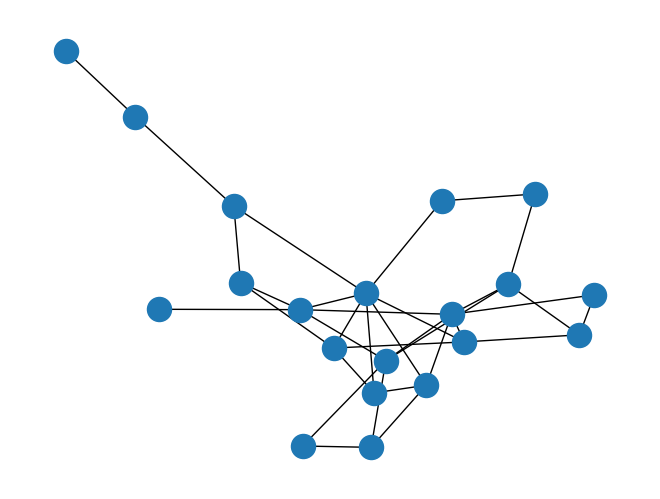

# Adjacency Bit manipulation for Rewiring

## Optimization 1
It takes whole list of sigma_1 and sigma_2, then optimize directly by applying arithmetic over these.

### SBM 
block_sizes=[10,10], edge_probs=[[0.3, 0.1], [0.1, 0.3]]

## Optimization 2
It takes every element of sigma_1 and sigma_2 then optimize over each pair of element in these lists.

# Sampling the GVAE Graph after latent space rewiring
So we would first like to sample the graph variationally and then perform the node classifcation task

losses should backprop end to end